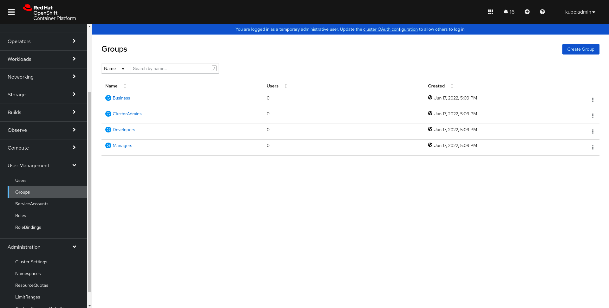

# OpenLDAP-OCP
Ce guide decris comment synchroniser les Groupes Openshift avec un LDAP. On commencera dans un premier temps par deployer OpenLDAP sur un cluster Openshift. On configurera ensuite ce LDAP comme identity provider. Enfin on mettre en place une synchronisation entre les groupes Openshift et le LDAP

## Deploiement du LDAP

Le protocole LDAP (Lightweight Directory Access Protocol) est un protocole qui  permet d'accéder à des bases d'informations sur les utilisateurs d'un réseau, via l'interrogation d'annuaires. Il utilise pour cela un autre protocole, TCP/IP. Nous utiliserons ici OpenLDAP une implementation libre du procole LDAP en utilisant l'image bintanmi openldap.

```shell
oc apply -f openldap.yaml 
```

Ce manifest creer un Namespace openldap-auth, un service exposant via NodePort sur le port 30389 l'application openldap, un PersistenVolumclaim openldap-data qui sera monte sur /bitnami/openldap, et un deploiement de l'image. On ajoute des variables d'environnement pour specifie le Domain component (dc) et le login/password de l'admin (ici admin:admin dans notre fichier yaml). 

Une fois que le pod est running on peut verifier que celui-ci fonctionne avec la commande suivante :

```shell
ldapsearch -x -H ldap://192.168.100.81:30389 -b  'dc=company,dc=local' 
```

L'adresse Ip dois etre remplacer par l'IP de l'un de noeuds de votre cluster. 

Vous pouvew ensuite utiliser le fichier ldif pour construire le contenue de votre AD. L'exemple presentee ici dispose de deux Organisation Unit (Groups et People). Il creer egalement 4 groupes ClusterAdmins, Managers, Developers et Business ansi que des utilisateurs appartenant a ces 4 groupes.

```shell
ldapmodify -a -x -H ldap://192.168.100.81:30389 -D 'cn=admin,dc=company,dc=local' -f Company.ldif -W -cZ
```

Vous pouview verifier que les groupes et utilisateurs on correctement ete ajoute avec la meme commande que precedemment.


```shell
ldapsearch -x -H ldap://192.168.100.81:30389 -b  'dc=company,dc=local' 
```

## Configuring le LDAP identity Provider

Nous allons maintenant permettre l'authentification des utilisateur de l'AD dans Openshift.

Pour cela on va modifier la configuration d'Openshift Oauth en ajoutant notre LDAp comme identity provider ansi que les autres elements necessaire pour la configuration. 

```shell
oc apply -f idp-config.yaml
```

Note: Cette configuration est utilise dans le but de pouvoir rapidement tester l'integration entre LDAP et Openshift. Il sera necessaire par la suite de configurer un bindDN et un bindPassword utilisant un secret ainsi que le CA pour permettre une communication securisee.

Une fois l'Ouath mis-a-jour vous devriez voir un nouveau champs possible pour l'authentificaiton comme sur l'image suivante: 

Si vous avez utilisez le fichier ldif fournis dans ce git vous pouvez tester la connexion avec l'user martin et le mot de passe password.


Source: https://prograide.com/pregunta/2181/comment-ajouter-des-images-au-fichier-readmemd-sur-github

## Configuration de la synchronisation des groupes LDAP

OpenShift peut synchroniser les groupes LDAP en interrogeant le serveur LDAP et en les créant
comme des groupes Openshift. Ce processus doit être exécuté périodiquement pour s'assurer que les groupes sont tenus à jour. Les administrateurs peuvent ensuite accorder des autorisations basées sur des groupes LDAP, mais ces autorisations doivent être
attribués à l'aide du système OpenShift RBAC et ne sont pas hérités de l'IdM.
La ressource LDAPSyncConfig contient les paramètres dont le cluster OpenShift a besoin pour la synchronisation des groupes, qui peut être effectuée manuellement ou à l'aide d'un CronJob.

On creer dans un premier temps la resource LDAPSyncConfig. 

```shell
oc apply -f ldapsyncConfig.yaml
```

Ce manifest fournis définition de requête LDAP pour les entrées d'utilisateur et de groupe, ainsi que les attributs avec lesquels les représenter dans les enregistrements internes d'OpenShift Container Platform.

On peut ensuite verifier que le processus de synchronisation est correctement calibre a l'aide de la commande suivante (dry-run) :

```shell
oc adm groups sync --sync-config ldapsyncConfig.yaml 
```

Enfin on va mettre en place un CronJob pour realiser une synchronisation periodique entre Openshift et le LDAP. 
Ce manifest :
  - creer un nouveau namespace [ldap-sync]
  - creer un nouveau service account [ldap-group-syncer]
  - creer un clusterRole et un ClusterRoleBinding permettant la creation et la mis-a-jour des groupes dans Openshift
  - creer une configMap pour specifie les fichiers de configuration des fichiers
  - creer un cron-job qui effectue de maniere periodique la sychronisation entre le LDAP et Openshift

```shell
oc apply -f openldap-sync.yaml
```

Lorsque le cronjob aura ete applique vous devriez voir dans la section Openshift User les groupes de votre annuaire LDAP. 




